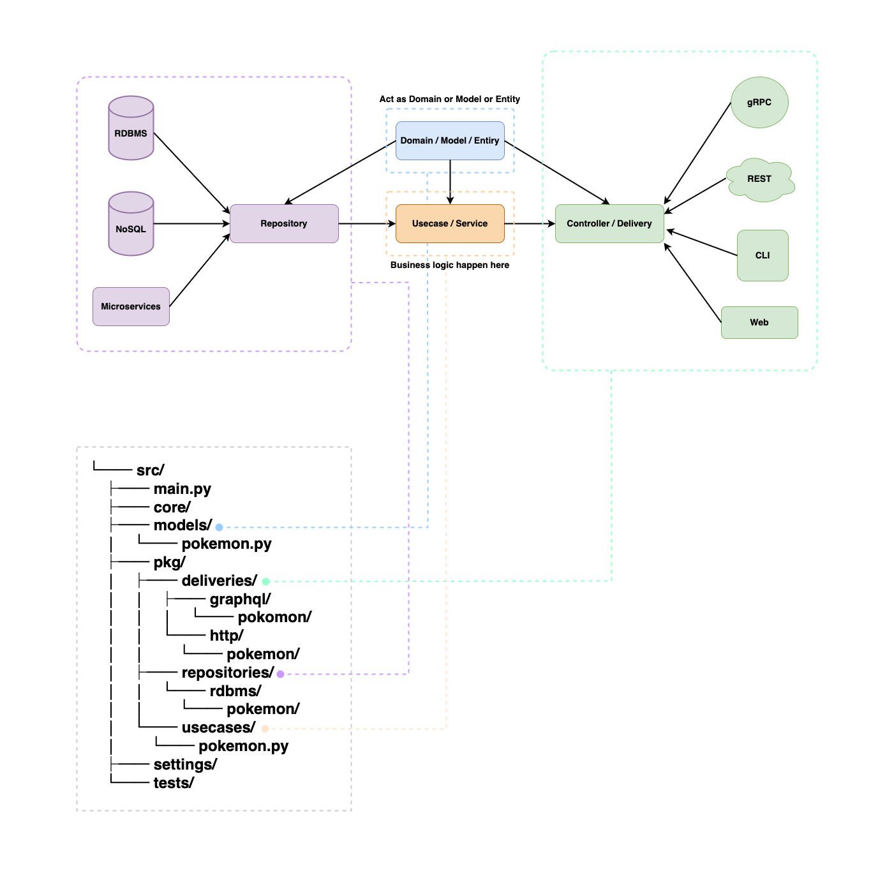

# python-clean-arch

This is an example of implementing a Pokémon API based on the Clean Architecture in a Python project, referencing [go-clean-arch](https://github.com/bxcodec/go-clean-arch)

## Description

Rule of Clean Architecture by Uncle Bob [^1]

- Independent of Frameworks. The architecture does not depend on the existence of some library of feature laden software. This allows you to use such frameworks as tools, rather than having to cram your system into their limited constraints.
- Testable. The business rules can be tested without the UI, Database, Web Server, or any other external element.
- Independent of UI. The UI can change easily, without changing the rest of the system. A Web UI could be replaced with a console UI, for example, without changing the business rules.
- Independent of Database. You can swap out Oracle or SQL Server, for Mongo, BigTable, CouchDB, or something else. Your business rules are not bound to the database.
- Independent of any external agency. In fact your business rules simply don’t know anything at all about the outside world.

The project, like the original project, has 4 domain layers:

- Models Layer
- Repository Layer
- Usecase Layer
- Delivery Layer

In addition, Unit of Work Pattern [^2] and Dependency Injection Pattern [^3] are added

#### The diagram:



### How To Run This Project

pre-work, install python (>=3.10) and poetry (>=1.4.0)

```sh
$ poetry env use python
$ poetry shell
$ poetry install --no-root
```

#### Run the Application

```sh
$ make up
```

or

```sh
$ docker-compose up
```

#### Run the Testing

```sh
$ make test
```

<br>

## Changelog

- **v1**: checkout to the [v1 branch](https://github.com/cdddg/py-clean-arch/tree/v1)
  archived to v1 branch on 2018
  Desc: Initial proposal by me
- **v2**: master branch
  merged to master on 2023.
  Desc: Introducing Domain package, the details can be seen on this PR [#1](https://github.com/cdddg/py-clean-arch/issues/1)

<br>

[^1]: https://github.com/bxcodec/go-clean-arch#description 
[^2]: https://www.cosmicpython.com/book/chapter_06_uow.html
[^3]: https://en.wikipedia.org/wiki/Dependency_injection
