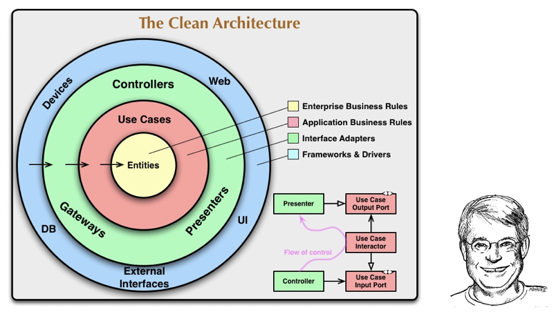
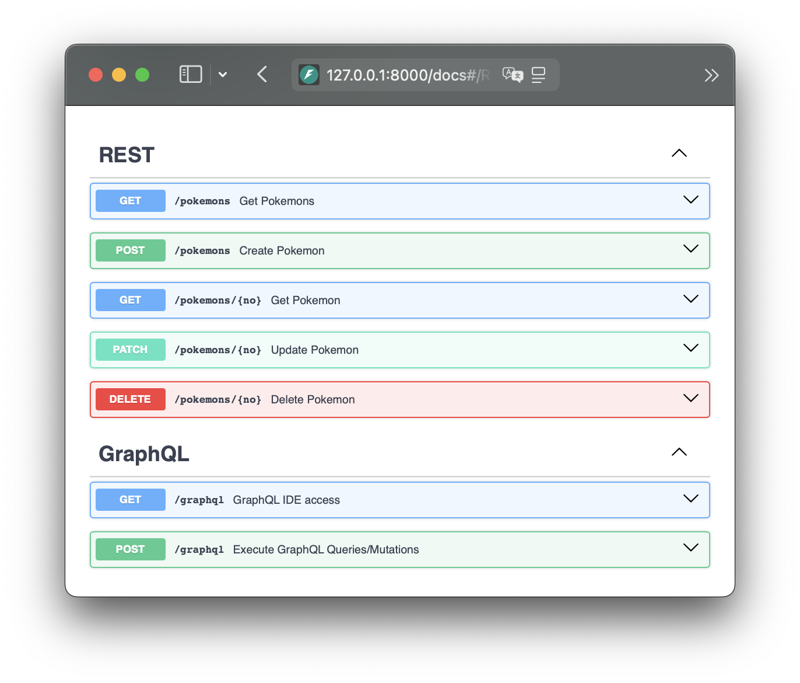

# py-clean-arch

This Python project showcases the implementation of a Pokémon API following the Clean Architecture principles, built with the FastAPI framework. It serves as a practical example of designing a testable, maintainable, and scalable system architecture.

## Changelog

- **v1**: Check out the [v1 branch](https://github.com/cdddg/py-clean-arch/tree/v1).<br> Archived in April 2021. <br>
  Description: Initial proposal by me.

  > Core Architecture Setup<br>
  > ☑️ Built complete `FastAPI` project structure with modular `src/` organization<br>
  > ☑️ Implemented `Repository pattern` for data access layer
  >
  > API Implementation<br>
  > ☑️ Implemented `RESTful` Pokemon `CRUD` endpoints<br>
  >
  > Development Tooling<br>
  > ☑️ Added `Docker` containerization support<br>
  > ☑️ Established `pytest` testing framework with test cases

- **v2**: Check out the [v2 branch](https://github.com/cdddg/py-clean-arch/tree/v2).<br> Archived in July 2023. <br>
  Description: Improvement from v1, For details, see [PR #1 to PR #10](https://github.com/cdddg/py-clean-arch/pulls?q=is%3Apr+is%3Aclosed+merged%3A2023-04-09..2023-08-15)

  > Core Refactor: Inspired by [go-clean-arch v3](https://github.com/bxcodec/go-clean-arch/tree/v3)<br>
  > ☑️ Adopted Go project directory structure: `pkg/deliveries/`, `pkg/repositories/`, `pkg/usecases/`
  >
  > Clean Architecture Implementation<br>
  > ☑️ Added `Unit of Work` and `Dependency Injection` design patterns<br>
  > ☑️ Strict separation of layer responsibilities following Uncle Bob's `Clean Architecture` principles
  >
  > API Style Expansion<br>
  > ☑️ Added comprehensive `GraphQL` API support (mutations, queries, schemas)
  >
  > Multi-Database Support<br>
  > ☑️ Multi-database support: `MySQL`, `PostgreSQL`, `SQLite`<br>
  > ☑️ Implemented async `SQLAlchemy 2.0`

- **v3**: Check out the [v3 branch](https://github.com/cdddg/py-clean-arch/tree/v3). <br> Archived in August 2025. <br>Description: Transition to Python-centric design from Go. For details, see [PR #11 to PR #46](https://github.com/cdddg/py-clean-arch/pulls?q=is%3Apr+is%3Aclosed+merged%3A2023-08-15..2025-08-02).

  > Go-style to Python-centric Transition<br>
  > ☑️ Removed Go-idiomatic `pkg/` structure, adopted Python ecosystem conventions
  >
  > NoSQL Database Expansion<br>
  > ☑️ Added `MongoDB` document database support (`document-oriented`)<br>
  > ☑️ Added `Redis` key-value database support (`key-value store`)
  >
  > Testing Architecture Enhancement<br>
  > ☑️ Established three-tier testing structure: `unit`, `integration`, `functional`
  >
  > DevOps and Toolchain<br>
  > ☑️ Added `GitHub Actions` CI/CD pipeline<br>
  > ☑️ Integrated code quality tools: `cspell`, `pylint`, `ruff`, `pyright`

- ✏️ **v4**: **Under development on the `master` branch.** <br>
  - [ ] Adding HTTP/2-based gRPC support to expand API protocols beyond HTTP-based REST and GraphQL

## Description

The Clean Architecture, popularized by [Uncle Bob](https://blog.cleancoder.com/uncle-bob/2012/08/13/the-clean-architecture.html), emphasizes several foundational principles:

1. **Framework Independence**: The system isn't reliant on external libraries or frameworks.
2. **Testability**: Business rules can be validated without any external elements.
3. **UI Independence**: Switching out the user interface won't affect the underlying system.
4. **Database Independence**: The system's business logic isn't tied to a specific database.
5. **Independence from External Agencies**: The business logic remains agnostic of external integrations.


\*source: [yoan-thirion.gitbook.io](https://yoan-thirion.gitbook.io/knowledge-base/software-craftsmanship/code-katas/clean-architecture)

### 🧱 Project Structure Overview & Clean Architecture Mapping

Based on Uncle Bob's Clean Architecture principles, this project's structure and architecture flow diagrams are aligned with these principles.

#### Directory Structure

Here's a glimpse of the project's high-level structure, highlighting primary directories and key files:

```ini
./
├── ...
├── src/
│   ├── di/                   - Dependency injection configurations for managing dependencies.
│   │   ├── dependency_injection.py
│   │   └── unit_of_work.py
│   │
│   ├── controllers/          - External interfaces like REST & GraphQL endpoints.
│   │   ├── graphql/          - GraphQL components for a flexible API.
│   │   └── rest/             - RESTful API routes and controllers.
│   │                           ('Frameworks and Drivers' and part of 'Interface Adapters' in Clean Architecture)
│   │
│   ├── usecases/             - Contains application-specific business rules and implementations.
│   │                           ('Use Cases' in Clean Architecture)
│   │
│   ├── repositories/         - Data interaction layer, converting domain data to/from database format.
│   │   ├── relational_db/    - Operations for relational databases (e.g., SQLite, MySQL, PostgreSQL).
│   │   ├── document_db/      - Operations for document-oriented databases (e.g., MongoDB, CouchDB).
│   │   └── key_value_db/     - Operations for key-value databases (e.g., Redis, Memcached).
│   │                           ('Interface Adapters' in Clean Architecture)
│   │
│   ├── models/               - Domain entities representing the business data.
│   │                           ('Entities' in Clean Architecture)
│   │
│   ├── common/               - Shared code and utilities.
│   ├── settings/
│   │   └── db/               - Database configurations.
│   │                           ('Frameworks and Drivers' in Clean Architecture)
│   │
│   └── main.py               - Main file to launch the application.
│
└── tests/
    ├── api_db_test.bats      - BATs tests for API and database interactions.
    ├── functional/           - Functional tests for testing the overall functionality and behavior of the application.
    ├── integration/          - Integration tests for testing module interactions.
    └── unit/                 - Unit tests for testing individual components in isolation.
```

#### Clean Architecture Flow Diagram

The Clean Architecture Flow Diagram visualizes the layers of Clean Architecture and how they interact. It consists of two images and an ASCII flow for clarity:

> For a detailed explanation of the ASCII flow, refer to [ascii-flow.md](./docs/ascii-flow.md).


\*source: [yoan-thirion.gitbook.io](https://yoan-thirion.gitbook.io/knowledge-base/software-craftsmanship/code-katas/clean-architecture)


\*source: https://stackoverflow.com/a/73788685

### ✨ Additional Features and Patterns in This Project

This project not only adheres to Uncle Bob's Clean Architecture principles but also incorporates modern adaptations and extended features to meet contemporary development needs:

- **GraphQL vs REST**:<br>The `controllers` module contains two API interfaces. `graphql` provides for a robust GraphQL API, while `rest` focuses on RESTful API routes and controls.
- **RelationalDB vs NoSQL**:<br>The `repositories` module supports both relational databases (e.g., SQLite, MySQL, PostgreSQL) and NoSQL databases, including document-oriented stores (e.g., MongoDB, CouchDB) and key-value stores (e.g., Redis, Memcached).

Apart from following Uncle Bob's Clean Architecture, this project also incorporates:

- **Repository Pattern**:<br>An abstraction that simplifies the decoupling of the model layer from data storage, thereby promoting flexibility and maintainability in the codebase. [^1]
- **Unit of Work Pattern**:<br>This pattern ensures that all operations within a single transaction are completed successfully, or none are completed at all. [^2]
- **Dependency Injection Pattern**:<br>Helps in reducing direct dependencies between codes, increasing the testability and flexibility of modules. [^3]
- **Asynchronous SQLalchemy**:<br>By utilizing the asynchronous capabilities of SQLAlchemy 2.0, database operations are optimized for performance and efficiently handle multitasking. [^4]

## Getting Started

Get this project up and running on your local machine for development and testing.

### ⚡︎ Quick Start

Start the application with a single command:

```sh
$ docker compose up app
```

Access the API documentation at [http://localhost:8000/docs](http://localhost:8000/docs) and try the interactive endpoints.



### 🐳 Database Options

Choose from multiple supported database types:

<a id="supported-database-uris"></a>

**Supported Database URIs:**

- `sqlite+aiosqlite:///<dbname>.db` (SQLite)
- `sqlite+aiosqlite:///:memory:` (In-Memory SQLite) - **Default**
- `mysql+asyncmy://<username>:<password>@<host>:<port>/<dbname>` (MySQL)
- `postgresql+asyncpg://<username>:<password>@<host>:<port>/<dbname>` (PostgreSQL)
- `mongodb://<username>:<password>@<host>:<port>/<dbname>` (MongoDB)
- `redis://<username>:<password>@<host>:<port>/<dbname>` (Redis)

> 📌 **Note**: If you encounter database initialization issues, append **`reinitialize=true`** to the `DATABASE_URI`, e.g., `sqlite+aiosqlite:///sqlite.db?reinitialize=true`.

**Start databases with Docker Compose:**
```sh
$ docker compose down --remove-orphans -v
$ docker compose up dockerize
```

### 🔧 Development Setup

Set up your local development environment:

1. **Install prerequisites:** <u>Python 3.11+</u> and <u>Poetry 2.1.x+</u>

2. **Configure your environment:** [^6]
   
   ```sh
   $ poetry env use python3.11
   $ poetry shell
   $ poetry install
   ```
   
3. **Launch the application:**
   
   ```sh
   # With default SQLite database
   $ make up
   
   # With specific database
   $ DATABASE_URI=<database-uri> make up
   ```
   
4. **Access the application:** [http://localhost:8000](http://localhost:8000/)

### 🧪 Testing

#### Single Database Testing

Test against a specific database by setting the `DATABASE_URI` environment variable:

```sh
$ DATABASE_URI=<database-uri> pytest
```

> For supported database URIs, see [**Database Options**](#supported-database-uris)
>
> 📌 **Note**: Use a different `dbname` with "\_test" suffix for testing (e.g., "mydatabase_test") to avoid interfering with your main application data.

#### Multi-Database Testing with Coverage [^5]

Test across all supported databases (SQLite, MySQL, PostgreSQL, MongoDB, Redis) using `bats`:

1. **Install bats:** Follow the [installation guide](https://bats-core.readthedocs.io/en/stable/installation.html)

2. **Run comprehensive tests:**

```sh
$ make test
api_db_test.bats
 ✓ Test using in-memory SQLite [9671]
 ✓ Test using MySQL [10551]
 ✓ Test using PostgreSQL [9104]
 ✓ Test using MongoDB [10780]
 ✓ Test using Redis [8422]

5 tests, 0 failures in 49 seconds

Name                                                   Stmts   Miss   Cover   Missing
-------------------------------------------------------------------------------------
src/common/type.py                                        15      2  86.67%   15, 30
src/common/utils.py                                        5      1  80.00%   9
src/di/dependency_injection.py                            49      1  97.96%   139
src/di/unit_of_work.py                                    58      2  96.55%   56-59
src/controllers/rest/extension.py                         14      1  92.86%   28
src/main.py                                               30      8  73.33%   20-26, 49, 54
src/models/pokemon.py                                     48      2  95.83%   45, 57
src/repositories/document_db/pokemon/repository.py        84      7  91.67%   117, 127-128, 167, 176, 216, 238
src/repositories/key_value_db/pokemon/repository.py      148      6  95.95%   71, 82, 128, 142, 210-211
src/repositories/relational_db/pokemon/repository.py      72      3  95.83%   52, 73, 79
src/usecases/pokemon.py                                   40      6  85.00%   16, 19-21, 47, 51
-------------------------------------------------------------------------------------
TOTAL                                                    881     39  95.57%

36 files skipped due to complete coverage.
Wrote HTML report to htmlcov/index.html
```

  ## Frequently Asked Questions
Questions about the architecture? Check our [FAQ](./docs/faq.md).

## Enjoying the Project .ᐣ

If this project helped you, a ⭐ would be greatly appreciated!

[^1]: https://www.cosmicpython.com/book/chapter_02_repository.html

[^2]: https://www.cosmicpython.com/book/chapter_06_uow.html

[^3]: https://en.wikipedia.org/wiki/Dependency_injection

[^4]: https://docs.sqlalchemy.org/en/20/orm/extensions/asyncio.html

[^5]: The coverage rate for this 'py-clean-arch' project stands at 95.57%, based on test results from October 11, 2024.

[^6]: The `poetry install` command installs all required packages for running and developing the application. However, it does not include `cspell`. If you need `cspell` for spell checking, please refer to the official installation guide at [cspell installation guide](https://cspell.org/docs/installation/)
