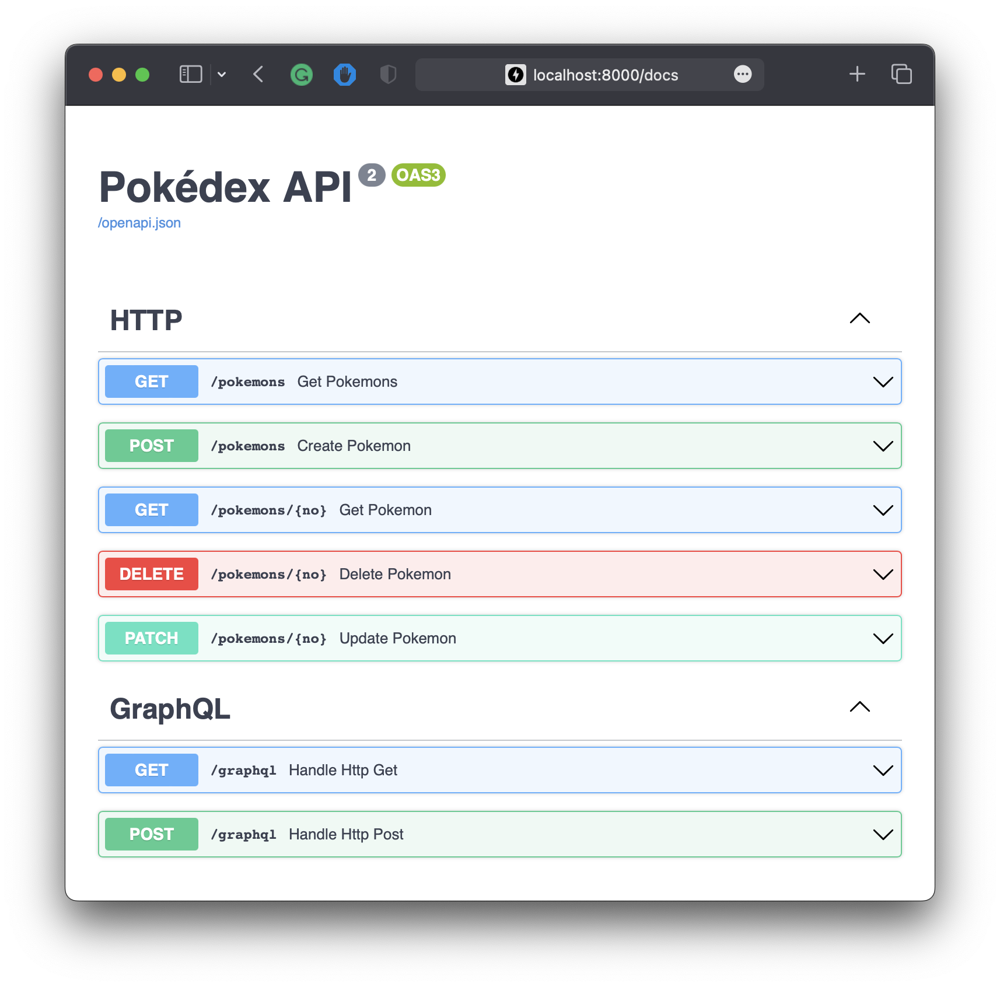

# py-clean-arch

This is an example of implementing a Pokémon API based on the Clean Architecture in a Python project, referencing [**go-clean-arch**](https://github.com/bxcodec/go-clean-arch).

## Changelog

- **v1**: Check out the [v1 branch](https://github.com/cdddg/py-clean-arch/tree/v1).<br> Archived in April 2021. <br>**Description**: Initial proposal by me.

- **v2**: Check out the [v2 branch](https://github.com/cdddg/py-clean-arch/tree/v2).<br> Archived in July 2023. <br>**Description**: Improvements from v1. See the [merged PRs from PR #1 to PR #10](https://github.com/cdddg/py-clean-arch/pulls?q=is%3Apr+is%3Aclosed+merged%3A2023-04-09..2023-08-15).

- ✏️ **v3**: Current version on the `master` branch. <br>Merged to main in August 2023 and still evolving. <br>**Description**: Transition to Python-centric design from Go. Start with PR [#11](https://github.com/cdddg/py-clean-arch/pull/11) and see [all subsequent PRs](https://github.com/cdddg/py-clean-arch/pulls?q=is%3Apr+is%3Aclosed+merged%3A2023-08-16..2099-12-31).

## Description

The Clean Architecture, popularized by [Uncle Bob](https://blog.cleancoder.com/uncle-bob/2012/08/13/the-clean-architecture.html), emphasizes several foundational principles:

1. **Framework Independence**: The system isn't reliant on external libraries or frameworks.
2. **Testability**: Business rules can be validated without any external elements.
3. **UI Independence**: Switching out the user interface won't affect the underlying system.
4. **Database Independence**: The system's business logic isn't tied to a specific database.
5. **Independence from External Agencies**: The business logic remains agnostic of external integrations.


*source: [yoan-thirion.gitbook.io](https://yoan-thirion.gitbook.io/knowledge-base/software-craftsmanship/code-katas/clean-architecture)

### ✨ Additional Features and Patterns in This Project

This project doesn't just adhere to Uncle Bob's Clean Architecture principles; it also brings in modern adaptions and extended features to suit contemporary development needs:

- **GraphQL vs HTTP**:<br>The `entrypoints` module contains two API interfaces. `graphql` provides for a robust GraphQL API, while `http` focuses on RESTful API routes and controls.
- **RelationalDB vs NoSQL**:<br>The `repositories` module supports both relational and NoSQL databases. `relational_db` manages operations for databases like SQLite, MySQL, and PostgreSQL, whereas `nosql` manages operations for NoSQL databases like MongoDB and CouchDB.

Apart from following Uncle Bob's Clean Architecture, this project also incorporates:

- **Repository Pattern**:<br>A simplifying abstraction that decouples the model layer from data storage, promoting flexibility and maintainability in the codebase.[^1]
- **Unit of Work Pattern**:<br>This pattern ensures that all operations within a single transaction are completed successfully, or none are completed at all. [^2]
- **Dependency Injection Pattern**:<br>Helps in reducing direct dependencies between codes, increasing the testability and flexibility of modules. [^3]
- **Asynchronous SQLalchemy**:<br>By utilizing the asynchronous capabilities of SQLAlchemy 2.0, database operations are optimized for performance and efficiently handle multitasking. [^4]

### 🧱 Project Structure Overview & Clean Architecture Mapping

Based on Uncle Bob's Clean Architecture principles, this project's structure and architecture flow diagrams are aligned with these principles.

#### Directory Structure

Here's a glimpse of the project's high-level structure, highlighting primary directories and key files:

```ini
./
├── ...
├── src/
│   ├── di/                   - Dependency injection configurations for managing dependencies.
│   │   ├── dependency_injection.py
│   │   └── unit_of_work.py
│   │
│   ├── entrypoints/          - External interfaces like HTTP & GraphQL endpoints.
│   │   ├── graphql/          - GraphQL components for a flexible API.
│   │   └── http/             - RESTful API routes and controllers.
│   │                           ('Frameworks and Drivers' and part of 'Interface Adapters' in Clean Architecture)
│   │
│   ├── usecases/             - Contains application-specific business rules and implementations.
│   │                           ('Use Cases' in Clean Architecture)
│   │
│   ├── repositories/         - Data interaction layer, converting domain data to/from database format.
│   │   ├── nosql/            - Operations for NoSQL databases (e.g., MongoDB, CouchDB).
│   │   └── relational_db/    - Operations for relational databases (e.g., SQLite, MySQL, PostgreSQL).
│   │                           ('Interface Adapters' in Clean Architecture)
│   │
│   ├── models/               - Domain entities representing the business data.
│   │                           ('Entities' in Clean Architecture)
│   │
│   ├── common/               - Shared code and utilities.
│   ├── settings/
│   │   └── db/               - Database configurations.
│   │                           ('Frameworks and Drivers' in Clean Architecture)
│   │
│   └── main.py               - Main file to launch the application.
│
└── tests/
    ├── api_db_test.bats      - BATs tests for API and database interactions.
    ├── integration/          - Integration tests for testing module interactions.
    └── unit/                 - Unit tests for testing individual components in isolation.
```

#### Clean Architecture Flow Diagram

The Clean Architecture Flow Diagram visualizes the layers of Clean Architecture and how they interact. It consists of two images and an ASCII flow for clarity:

> For a detailed explanation of the ASCII flow, refer to [ascii-flow.md](./docs/ascii-flow.md).


*source: [yoan-thirion.gitbook.io](https://yoan-thirion.gitbook.io/knowledge-base/software-craftsmanship/code-katas/clean-architecture)*


*source: https://stackoverflow.com/a/73788685


## How To Run This Project

### 🐳 Database Setup

This application is designed to support multiple databases. Choose one of the following setups:

#### Default Configuration (In-Memory SQLite)

The application will default to using an **In-Memory SQLite** database if no `DATABASE_URI` is specified.

#### Diverse Databases with Docker-Compose

For other databases, Docker-Compose can be used:

```sh
$ docker compose down --remove-orphans -v
$ docker compose up dockerize
```

### 🚀 Launching the Application

1. If employing a specific database, ensure the `DATABASE_URI` environment variable is set appropriately.
2. Proceed to initiate the application.

<a id="supported-database-uris"></a>

> **Supported Database URIs:**:
>
> - `sqlite+aiosqlite:///sqlite.db` (SQLite)
> - `sqlite+aiosqlite:///:memory:` (In-Memory SQLite)
> - `mysql+asyncmy://<username>:<password>@<host>:<port>/<dbname>` (MySQL)
> - `postgresql+asyncpg://<username>:<password>@<host>:<port>/<dbname>` (PostgreSQL)
> - `mongodb://<username>:<password>@<host>:<port>/<dbname>` (MongoDB)
>
> 📌 **Note**: If encountering issues with database initialization, consider appending **`reinitialize=true`** to the `DATABASE_URI` for reconfiguration, e.g., `sqlite+aiosqlite:///sqlite.db?reinitialize=true`.

#### Using Docker compose:

Run the application inside a Docker container:
```sh
$ DATABASE_URI=<database-uri> docker-compose up app
```

#### Using Make (with Poetry):

1. Ensure Python (version >= 3.10) and Poetry (version >= 1.5, < 1.6) are installed.

2. Configure your environment:
   ```sh
   $ poetry env use python3.10
   $ poetry shell
   $ poetry install --no-root
   ```

3. Launch the application:
   ```sh
   $ DATABASE_URI=<database-uri> make up
   ```

After setup, access the application at [http://localhost:8000](http://localhost:8000/).



### 🧪 Testing the Application

#### Single Database Testing:

To test against a single database, specify its URI by setting the `DATABASE_URI` environment variable:

```sh
$ DATABASE_URI=<database-uri> pytest
```

> For the list of supported database URIs, please refer to the [**Supported Database URIs**](#supported-database-uris)
>
> 📌 **Note**: For testing, it's recommended to use a different `dbname`, preferably with a "_test" suffix (e.g., "mydatabase_test"). This ensures your tests don't interfere with your main application data.

#### Multi-Database Testing:

To validate your application across various databases like In-Memory SQLite, SQLite, MySQL, Postgres and MongoDB, you'll utilize the tool called `bats`.

1. Installing `bats`

   **-** On macOS: use [Homebrew](https://brew.sh/)

      ```sh
      $ brew install bats
      ```
   
   **-** On Linux: compile from the official [GitHub repository](https://github.com/bats-core/bats-core)
   
   ```sh
   $ git clone https://github.com/bats-core/bats-core.git
   $ cd bats-core
   $ ./install.sh /usr/local
   ```
   
2. Running Multi-DB Tests

      ```console
      $ make test
      
      api_db_test.bats
    ✓ Test using SQLite [3136]
    ✓ Test using In-Memory SQLite [2399]
    ✓ Test using MySQL [3615]
    ✓ Test using PostgreSQL [3437]
    ✓ Test using MongoDB [4099]
      
   5 tests, 0 failures in 18 seconds
   ```
   

### 🔍 Checking Code Coverage

To demonstrate best practices and emphasize the importance of thorough testing, we've integrated `pytest-cov` to monitor our test coverage. [^5] 

To generate a coverage report:

```sh
$ pytest --cov
```

## Enjoying the Project?

A simple ⭐ can go a long way in showing your appreciation!


[^1]: https://www.cosmicpython.com/book/chapter_02_repository.html
[^2]: https://www.cosmicpython.com/book/chapter_06_uow.html
[^3]: https://en.wikipedia.org/wiki/Dependency_injection
[^4]: https://docs.sqlalchemy.org/en/20/orm/extensions/asyncio.html
[^5]: The coverage rate for this 'py-clean-arch' project stands at 91.33%, based on test results from August 20, 2023.
