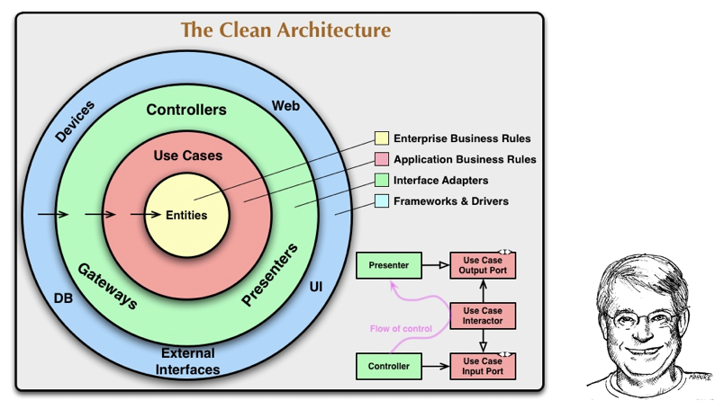
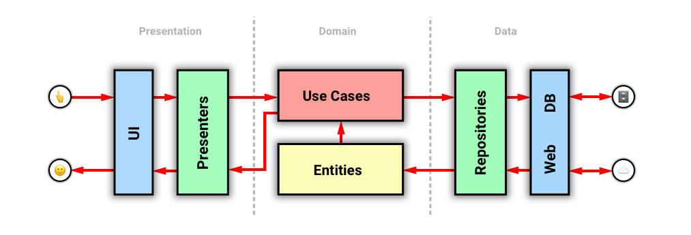
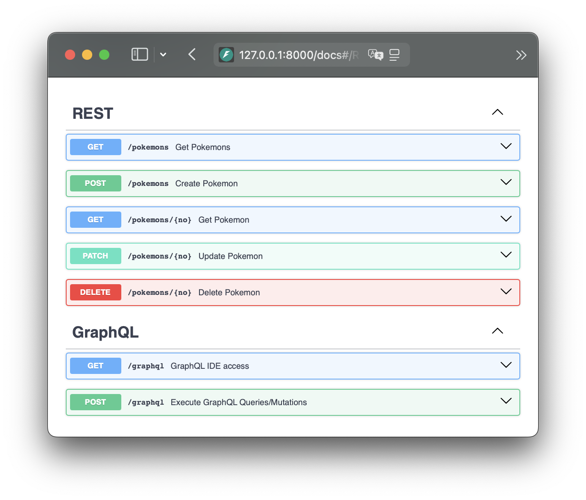

# py-clean-arch

This is an example of implementing a Pokémon API based on the Clean Architecture in a Python project, using the FastAPI framework.

## Changelog

- **v1**: Check out the [v1 branch](https://github.com/cdddg/py-clean-arch/tree/v1).<br> Archived in April 2021. <br>
  Description: Initial proposal by me.

  > Core Architecture Setup<br>
  > ☑️ Built complete `FastAPI` project structure with modular `src/` organization<br>
  > ☑️ Implemented `Repository pattern` for data access layer
  >
  > API Implementation<br>
  > ☑️ Implemented `RESTful` Pokemon `CRUD` endpoints<br>
  >
  > Development Tooling<br>
  > ☑️ Added `Docker` containerization support<br>
  > ☑️ Established `pytest` testing framework with test cases

- **v2**: Check out the [v2 branch](https://github.com/cdddg/py-clean-arch/tree/v2).<br> Archived in July 2023. <br>
  Description: Improvement from v1, For details, see [PR #1 to PR #10](https://github.com/cdddg/py-clean-arch/pulls?q=is%3Apr+is%3Aclosed+merged%3A2023-04-09..2023-08-15)

  > Core Refactor: Inspired by [go-clean-arch v3](https://github.com/bxcodec/go-clean-arch/tree/v3)<br>
  > ☑️ Adopted Go project directory structure: `pkg/deliveries/`, `pkg/repositories/`, `pkg/usecases/`
  >
  > Clean Architecture Implementation<br>
  > ☑️ Added `Unit of Work` and `Dependency Injection` design patterns<br>
  > ☑️ Strict separation of layer responsibilities following Uncle Bob's `Clean Architecture` principles
  >
  > API Style Expansion<br>
  > ☑️ Added comprehensive `GraphQL` API support (mutations, queries, schemas)
  >
  > Multi-Database Support<br>
  > ☑️ Multi-database support: `MySQL`, `PostgreSQL`, `SQLite`<br>
  > ☑️ Implemented async `SQLAlchemy 2.0`

- **v3**: Check out the [v3 branch](https://github.com/cdddg/py-clean-arch/tree/v3). <br> Archived in August 2025. <br>Description: Transition to Python-centric design from Go. For details, see [PR #11 to PR #46](https://github.com/cdddg/py-clean-arch/pulls?q=is%3Apr+is%3Aclosed+merged%3A2023-08-15..2025-08-02).

  > Go-style to Python-centric Transition<br>
  > ☑️ Removed Go-idiomatic `pkg/` structure, adopted Python ecosystem conventions
  >
  > NoSQL Database Expansion<br>
  > ☑️ Added `MongoDB` document database support (`document-oriented`)<br>
  > ☑️ Added `Redis` key-value database support (`key-value store`)
  >
  > Testing Architecture Enhancement<br>
  > ☑️ Established three-tier testing structure: `unit`, `integration`, `functional`
  >
  > DevOps and Toolchain<br>
  > ☑️ Added `GitHub Actions` CI/CD pipeline<br>
  > ☑️ Integrated code quality tools: `cspell`, `pylint`, `ruff`, `pyright`

- ✏️ **v4**: **Under development on the `master` branch.** <br>
  - [ ] Adding HTTP/2-based gRPC support to expand API protocols beyond HTTP-based REST and GraphQL

## Description

The Clean Architecture, popularized by [Uncle Bob](https://blog.cleancoder.com/uncle-bob/2012/08/13/the-clean-architecture.html), emphasizes several foundational principles:

1. **Framework Independence**: The system isn't reliant on external libraries or frameworks.
2. **Testability**: Business rules can be validated without any external elements.
3. **UI Independence**: Switching out the user interface won't affect the underlying system.
4. **Database Independence**: The system's business logic isn't tied to a specific database.
5. **Independence from External Agencies**: The business logic remains agnostic of external integrations.


\*source: [yoan-thirion.gitbook.io](https://yoan-thirion.gitbook.io/knowledge-base/software-craftsmanship/code-katas/clean-architecture)

### ✨ Additional Features and Patterns in This Project

This project not only adheres to Uncle Bob's Clean Architecture principles but also incorporates modern adaptations and extended features to meet contemporary development needs:

- **GraphQL vs REST**:<br>The `controllers` module contains two API interfaces. `graphql` provides for a robust GraphQL API, while `rest` focuses on RESTful API routes and controls.
- **RelationalDB vs NoSQL**:<br>The `repositories` module supports both relational databases (e.g., SQLite, MySQL, PostgreSQL) and NoSQL databases, including document-oriented stores (e.g., MongoDB, CouchDB) and key-value stores (e.g., Redis, Memcached).

Apart from following Uncle Bob's Clean Architecture, this project also incorporates:

- **Repository Pattern**:<br>An abstraction that simplifies the decoupling of the model layer from data storage, thereby promoting flexibility and maintainability in the codebase. [^1]
- **Unit of Work Pattern**:<br>This pattern ensures that all operations within a single transaction are completed successfully, or none are completed at all. [^2]
- **Dependency Injection Pattern**:<br>Helps in reducing direct dependencies between codes, increasing the testability and flexibility of modules. [^3]
- **Asynchronous SQLalchemy**:<br>By utilizing the asynchronous capabilities of SQLAlchemy 2.0, database operations are optimized for performance and efficiently handle multitasking. [^4]

### 🧱 Project Structure Overview & Clean Architecture Mapping

Based on Uncle Bob's Clean Architecture principles, this project's structure and architecture flow diagrams are aligned with these principles.

#### Directory Structure

Here's a glimpse of the project's high-level structure, highlighting primary directories and key files:

```ini
./
├── ...
├── src/
│   ├── di/                   - Dependency injection configurations for managing dependencies.
│   │   ├── dependency_injection.py
│   │   └── unit_of_work.py
│   │
│   ├── controllers/          - External interfaces like REST & GraphQL endpoints.
│   │   ├── graphql/          - GraphQL components for a flexible API.
│   │   └── rest/             - RESTful API routes and controllers.
│   │                           ('Frameworks and Drivers' and part of 'Interface Adapters' in Clean Architecture)
│   │
│   ├── usecases/             - Contains application-specific business rules and implementations.
│   │                           ('Use Cases' in Clean Architecture)
│   │
│   ├── repositories/         - Data interaction layer, converting domain data to/from database format.
│   │   ├── relational_db/    - Operations for relational databases (e.g., SQLite, MySQL, PostgreSQL).
│   │   ├── document_db/      - Operations for document-oriented databases (e.g., MongoDB, CouchDB).
│   │   └── key_value_db/     - Operations for key-value databases (e.g., Redis, Memcached).
│   │                           ('Interface Adapters' in Clean Architecture)
│   │
│   ├── models/               - Domain entities representing the business data.
│   │                           ('Entities' in Clean Architecture)
│   │
│   ├── common/               - Shared code and utilities.
│   ├── settings/
│   │   └── db/               - Database configurations.
│   │                           ('Frameworks and Drivers' in Clean Architecture)
│   │
│   └── main.py               - Main file to launch the application.
│
└── tests/
    ├── api_db_test.bats      - BATs tests for API and database interactions.
    ├── functional/           - Functional tests for testing the overall functionality and behavior of the application.
    ├── integration/          - Integration tests for testing module interactions.
    └── unit/                 - Unit tests for testing individual components in isolation.
```

> 📌 **Note**: While this project uses `controllers` for the external interface layer, teams may prefer alternatives like `handlers` (event-driven), `endpoints` (API-focused), `routes` (Express.js style), `api` (simple), `interfaces` (DDD), `gateways` (microservices), or `entrypoints` (original Clean Architecture). Choose what best aligns with your team's vocabulary.

#### Clean Architecture Flow Diagram

The Clean Architecture Flow Diagram visualizes the layers of Clean Architecture and how they interact. It consists of two images and an ASCII flow for clarity:

> For a detailed explanation of the ASCII flow, refer to [ascii-flow.md](./docs/ascii-flow.md).


\*source: [yoan-thirion.gitbook.io](https://yoan-thirion.gitbook.io/knowledge-base/software-craftsmanship/code-katas/clean-architecture)


\*source: https://stackoverflow.com/a/73788685

## Getting Started

Here's everything you need to get this project running on your local machine for development and testing.

### 🐳 Database Setup

This application is designed to support multiple databases. Choose one of the following setups:

#### Default Configuration (In-Memory SQLite)

The application will default to using an **In-Memory SQLite** database if no `DATABASE_URI` is specified.

#### Diverse Databases with Docker-Compose

For utilizing other databases, Docker Compose can be employed:

```sh
$ docker compose down --remove-orphans -v
$ docker compose up dockerize
```

### 🚀 Launching the Application

1. If employing a specific database, ensure the `DATABASE_URI` environment variable is set appropriately.
2. Proceed to initiate the application.

<a id="supported-database-uris"></a>

> **Supported Database URIs:**:
>
> - `sqlite+aiosqlite:///<dbname>.db` (SQLite)
> - `sqlite+aiosqlite:///:memory:` (In-Memory SQLite)
> - `mysql+asyncmy://<username>:<password>@<host>:<port>/<dbname>` (MySQL)
> - `postgresql+asyncpg://<username>:<password>@<host>:<port>/<dbname>` (PostgreSQL)
> - `mongodb://<username>:<password>@<host>:<port>/<dbname>` (MongoDB)
> - `redis://<username>:<password>@<host>:<port>/<dbname>` (Redis)
>
> 📌 **Note**: If encountering issues with database initialization, consider appending **`reinitialize=true`** to the `DATABASE_URI` for reconfiguration, e.g., `sqlite+aiosqlite:///sqlite.db?reinitialize=true`.

#### Using Docker Compose:

To run the application inside a Docker container:

```sh
$ DATABASE_URI=<database-uri> docker compose up app
```

#### Using Make (with Poetry):

1. Ensure Python (version 3.11 or higher) and Poetry (version 2.1.x) are installed.

2. Configure your environment: [^6]

   ```sh
   $ poetry env use python3.11
   $ poetry shell
   $ poetry install
   ```

3. Launch the application:
   ```sh
   $ DATABASE_URI=<database-uri> make up
   ```

After setup, access the application at [http://localhost:8000](http://localhost:8000/).



### 🧪 Testing the Application

#### Single Database Testing:

To conduct tests against a single database, specify its URI by configuring the `DATABASE_URI` environment variable:

```sh
$ DATABASE_URI=<database-uri> pytest
```

> For the list of supported database URIs, please refer to the [**Supported Database URIs**](#supported-database-uris)
>
> 📌 **Note**: For testing, it's recommended to use a different `dbname`, preferably with a "\_test" suffix (e.g., "mydatabase_test"). This ensures your tests don't interfere with your main application data.

#### Multi-Database Testing and Code Coverage: [^5]

To validate your application across various databases like In-Memory SQLite, SQLite, MySQL, Postgres and MongoDB, you'll utilize the tool called `bats`.

1. Installing `bats`

   **-** On macOS: use [Homebrew](https://brew.sh/)

   ```sh
   $ brew install bats
   ```

   **-** On Linux: compile from the official [GitHub repository](https://github.com/bats-core/bats-core)

   ```sh
   $ git clone https://github.com/bats-core/bats-core.git
   $ cd bats-core
   $ ./install.sh /usr/local
   ```

2. Running Multi-DB tests and generating a test coverage report.

   ```shell
   $ make test
   api_db_test.bats
    ✓ Test using in-memory SQLite [9671]
    ✓ Test using MySQL [10551]
    ✓ Test using PostgreSQL [9104]
    ✓ Test using MongoDB [10780]
    ✓ Test using Redis [8422]
   
   5 tests, 0 failures in 49 seconds
   
   Name                                                   Stmts   Miss   Cover   Missing
   -------------------------------------------------------------------------------------
   src/common/type.py                                        15      2  86.67%   15, 30
   src/common/utils.py                                        5      1  80.00%   9
   src/di/dependency_injection.py                            49      1  97.96%   139
   src/di/unit_of_work.py                                    58      2  96.55%   56-59
   src/controllers/rest/extension.py                         14      1  92.86%   28
   src/main.py                                               30      8  73.33%   20-26, 49, 54
   src/models/pokemon.py                                     48      2  95.83%   45, 57
   src/repositories/document_db/pokemon/repository.py        84      7  91.67%   117, 127-128, 167, 176, 216, 238
   src/repositories/key_value_db/pokemon/repository.py      148      6  95.95%   71, 82, 128, 142, 210-211
   src/repositories/relational_db/pokemon/repository.py      72      3  95.83%   52, 73, 79
   src/usecases/pokemon.py                                   40      6  85.00%   16, 19-21, 47, 51
   -------------------------------------------------------------------------------------
   TOTAL                                                    881     39  95.57%
   
   36 files skipped due to complete coverage.
   Wrote HTML report to htmlcov/index.html
   ```

<br>

## Enjoying the Project?

A simple ⭐ can go a long way in showing your appreciation!

[^1]: https://www.cosmicpython.com/book/chapter_02_repository.html

[^2]: https://www.cosmicpython.com/book/chapter_06_uow.html

[^3]: https://en.wikipedia.org/wiki/Dependency_injection

[^4]: https://docs.sqlalchemy.org/en/20/orm/extensions/asyncio.html

[^5]: The coverage rate for this 'py-clean-arch' project stands at 95.57%, based on test results from October 11, 2024.

[^6]: The `poetry install` command installs all required packages for running and developing the application. However, it does not include `cspell`. If you need `cspell` for spell checking, please refer to the official installation guide at [cspell installation guide](https://cspell.org/docs/installation/)
