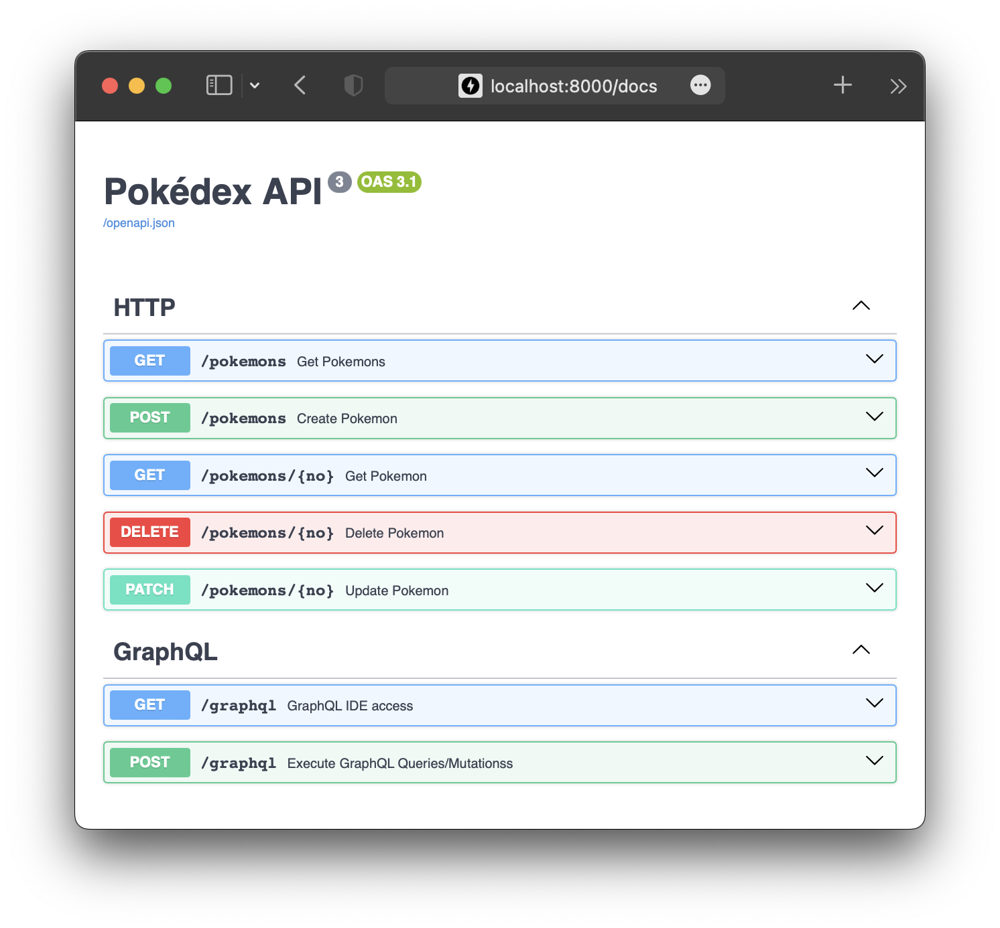

# py-clean-arch

This is an example of implementing a Pokémon API based on the Clean Architecture in a Python project, referencing [**go-clean-arch**](https://github.com/bxcodec/go-clean-arch)

## Description

Rule of Clean Architecture by Uncle Bob [^1]

- Independent of Frameworks. The architecture does not depend on the existence of some library of feature laden software. This allows you to use such frameworks as tools, rather than having to cram your system into their limited constraints.
- Testable. The business rules can be tested without the UI, Database, Web Server, or any other external element.
- Independent of UI. The UI can change easily, without changing the rest of the system. A Web UI could be replaced with a console UI, for example, without changing the business rules.
- Independent of Database. You can swap out Oracle or SQL Server, for Mongo, BigTable, CouchDB, or something else. Your business rules are not bound to the database.
- Independent of any external agency. In fact your business rules simply don’t know anything at all about the outside world.

The project, like the original project, has 4 domain layers:

- Models Layer
- Repository Layer
- Usecase Layer
- Delivery Layer

In addition, Add [Unit of Work Pattern](./src/settings/unit_of_work.py) [^2], [Dependency Injection Pattern](./src/settings/dependency_injection.py) [^3] <br>
and use Asynchronous SQLalchemy[^4]

#### The diagram:


### How To Run This Project

#### Run the Application

```sh
$ docker-compose up
```

or

pre-work, install python (>=3.10), poetry (>=1.5.1,<1.6) and setup

```sh
$ poetry env use python
$ poetry shell
$ poetry install --no-root
```

```sh
$ make up
```

application run on http://localhost:8000



#### Run the Testing

To test a single database, set the `SQLALCHEMY_DATABASE_URI` environment variable to the database URI and run:

```sh
$ SQLALCHEMY_DATABASE_URI=<database-uri> pytest
```

If no URI is provided, an in-memory SQLite database is used by default.

\---

Test multiple databases (in-memory SQLite, SQLite, MySQL, Postgres):

###### Install bats

To test multiple databases, you need to install the `bats` testing framework. On macOS, you can use [Homebrew](https://brew.sh/) to install `bats`:

```sh
$ brew install bats
```

On Linux, you can download `bats` from the official [GitHub repository](https://github.com/bats-core/bats-core) and compile it:

```sh
$ git clone https://github.com/bats-core/bats-core.git
$ cd bats-core
$ ./install.sh /usr/local
```

###### Run the tests

Once you have installed `bats`, run the following commands to test multiple databases:

```sh
$ make db
$ make test
```

### Code Coverage

As part of our commitment to maintain high standards, we use `pytest-cov` to ensure extensive test coverage. Currently, our code coverage stands at 95%. [^5]

To generate a coverage report:

```sh
$ pytest --cov
```

## Changelog

- **v1**: checkout to the [v1 branch ](https://github.com/cdddg/py-clean-arch/tree/v1)<br>
  archived to v1 branch on 2018 <br>
  Desc: Initial proposal by me
- **v2**: master branch <br>
  merged to master on 2023. <br>
  Desc: Improvement from v1, the details can be seen on this PR [#1](https://github.com/cdddg/py-clean-arch/issues/1)

[^1]: https://github.com/bxcodec/go-clean-arch#description
[^2]: https://www.cosmicpython.com/book/chapter_06_uow.html
[^3]: https://en.wikipedia.org/wiki/Dependency_injection
[^4]:  The asyncio extension as of SQLAlchemy 1.4.3 can now be considered to be **beta level** software. API details are subject to change however at this point it is unlikely for there to be significant backwards-incompatible changes. https://docs.sqlalchemy.org/en/14/orm/extensions/asyncio.html
[^5]: Test results as of [today's date, e.g., August 12, 2023].
